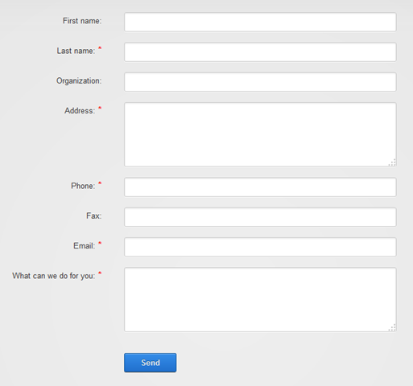
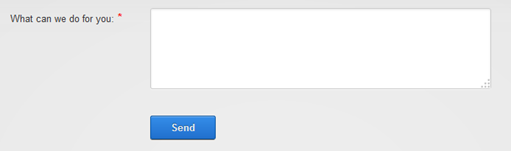
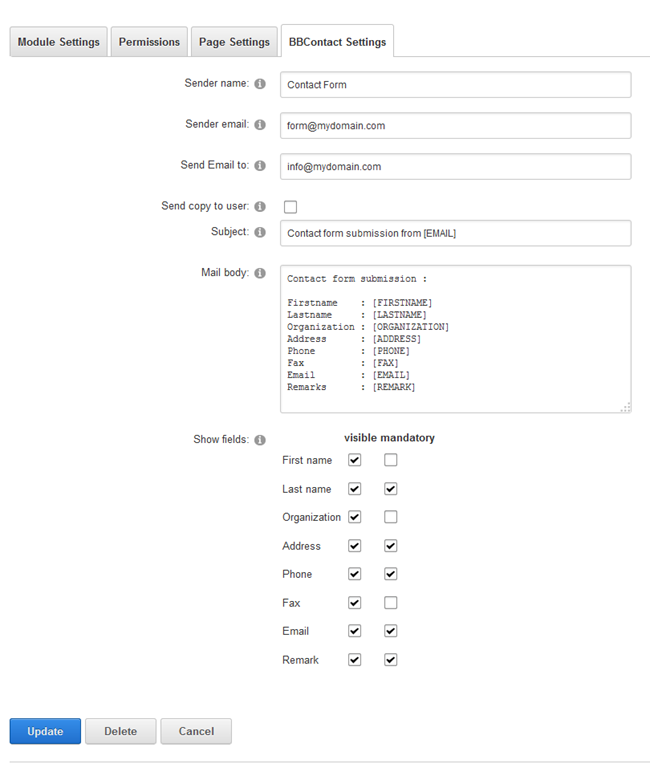

## Project Description

 The _bitboxx bbcontact_ module is a DNN module for providing a simple configurable contact form with easy setup and email notification. The minimum DNN Version for this module is **06.01.00** !

* * *

## Whats new ?
_Version 01.01.00 (14.10.2016):_

* Added Setting for usage with Bootstrap Skin 

_Version 01.00.00 (13.08.2014):_

* Initial release

* * *

## Installation

Install the module like every DNN module as a host account in System – Extensions or directly from the DNN Forge. After installation place a _bitboxx bbcontact_ module on the page where you want to show the contact form.

* * *

## UI

You can even use the full form:

or just a part of it (see Settings):

* * *

## Settings

The settings in detail:

<table width="500" border="1" cellspacing="0" cellpadding="2">
<tbody>
<tr>
<td width="129" valign="top">Sender name</td>
<td width="371" valign="top">Enter the name of the sender (e.g. "Contact Form on www.mydomain.com")</td>
</tr>
<tr>
<td width="129" valign="top">Sender email</td>
<td width="371" valign="top">Enter the email address of the sender (e.g. "contact@mydomain.com")</td>
</tr>
<tr>
<td width="129" valign="top">Send Email to</td>
<td width="371" valign="top">Enter the email address to where the information of the contact form shoud be sended</td>
</tr>
<tr>
<td width="129" valign="top">Send copy to user</td>
<td width="371" valign="top">Check if you want to send a copy to the user also</td>
</tr>
<tr>
<td width="129" valign="top">Subject</td>
<td width="371" valign="top">Enter the Subject for the email. Use the following placeholders: [FIRSTNAME],[LASTNAME],[ORGANIZATION],[ADDRESS],[PHONE],[FAX],[EMAIL],[REMARK]</td>
</tr>
<tr>
<td width="129" valign="top">Mail body</td>
<td width="371" valign="top">Enter the Mailtext for the Emailbody. Use the following placeholders: [FIRSTNAME],[LASTNAME],[ORGANIZATION],[ADDRESS],[PHONE],[FAX],[EMAIL],[REMARK]</td>
</tr>
<tr>
<td width="129" valign="top">Show fields</td>
<td width="371" valign="top">Check which fields should be shown and which are mandatory to fill in.</td>
</tr>
</tbody>
</table>